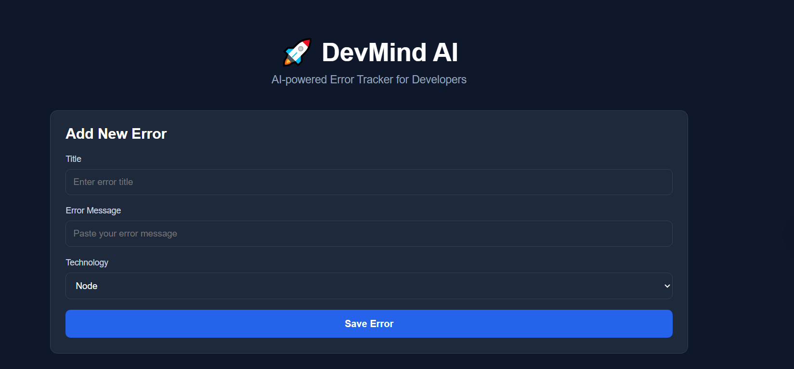
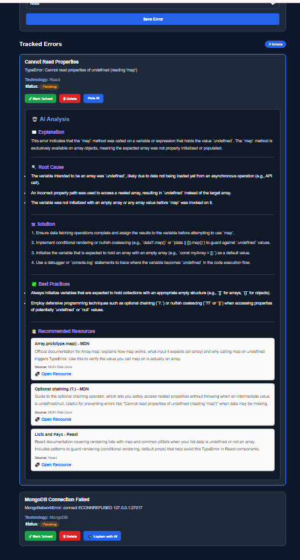

# 🚀 DevMind AI

DevMind AI is a full-stack AI-powered developer knowledge management platform that enables developers to log, analyze, and resolve coding errors efficiently. The application integrates Google Gemini AI for intelligent error analysis and uses n8n Cloud to automate AI-powered resource generation and scheduled weekly developer reports.

---

## 📌 Project Overview

> DevMind AI helps developers organize coding errors, generate AI-powered debugging insights, discover relevant learning resources, and receive automated weekly progress reports.


---


## 🌐 Live Demo

- **Frontend:** https://devmind-ai-gilt.vercel.app
- **Backend API:** https://devmind-ai-vto0.onrender.com
- **GitHub Repository:** https://github.com/shilpasharma-dev25/devmind-ai

**Tech Stack:** React • Node.js • Express • MongoDB • Gemini API • n8n • Gmail


---

# ✨ Features

- 📝 Create, update, and delete developer error logs
- 🤖 AI-powered error analysis using Google Gemini
- 💡 Automatic root cause identification and solution suggestions
- 📚 AI-powered learning resource generation using n8n AI Agent
- 📊 Weekly developer analytics using MongoDB Aggregation
- 📧 Scheduled weekly developer reports using n8n Cloud and Gmail
- ☁️ Frontend deployed on Vercel
- 🚀 Backend deployed on Render
- 🔗 RESTful API built with Express.js


---

# 🛠️ Tech Stack

### Frontend
- React (Vite)
- Axios
- CSS

### Backend
- Node.js
- Express.js
- MongoDB Atlas
- Mongoose

### AI & Automation
- Google Gemini API
- n8n Cloud
- Gmail API

### Deployment
- Vercel (Frontend)
- Render (Backend)


---

# 📁 Project Structure

```text
devmind-ai/
│
├── backend/
│   ├── controllers/
│   ├── models/
│   ├── routes/
│   ├── services/
│   ├── .env
│   ├── package.json
│   └── server.js
│
├── frontend/
│   ├── public/
│   ├── src/
│   │   ├── assets/
│   │   ├── components/
│   │   ├── pages/
│   │   ├── services/
│   │   ├── App.jsx
│   │   └── main.jsx
│   ├── .env.example
│   ├── package.json
│   └── vite.config.js
│
├── screenshots/
│   ├── dashboard.png
│   ├── tracked-errors.png
│   └── ai-analysis.png
│
└── README.md
```


---

# 🚀 Installation

## Clone the Repository

```bash
git clone https://github.com/shilpasharma-dev25/devmind-ai.git
```

## Navigate to the Project

```bash
cd devmind-ai
```

## Backend Setup

```bash
cd backend
npm install
```

Copy the `.env.example` file (if available), rename it to `.env`, and update the following values:

```env
MONGO_URI=your_mongodb_connection_string
GEMINI_API_KEY=your_gemini_api_key
PORT=5000
```

Start the backend server:

```bash
npm start
```

## Frontend Setup

Open a new terminal:

```bash
cd frontend
npm install
```

Copy the `.env.example` file, rename it to `.env`, and update:

```env
VITE_API_URL=YOUR_BACKEND_API_URL


```

Start the frontend:

```bash
npm run dev
```


---

# 📖 Usage

1. Launch the application in your browser.
2. Add a new error by entering:
   - Title
   - Error Message
   - Technology
3. Click **Save Error** to store the error in MongoDB.
4. View all saved errors under **Tracked Errors**.
5. For each error, you can:
   - ✅ Mark it as Solved
   - 🗑️ Delete the error
   - 🤖 Show or Hide AI Analysis
6. AI Analysis provides:
   - Error Explanation
   - Root Cause
   - Suggested Solutions
   - Best Practices
7. Generate AI-powered learning resources using the **n8n AI Agent** workflow.
8. Receive scheduled weekly developer reports via **n8n Cloud** and **Gmail**.


---

# ☁️ Deployment

| Component | Platform |
|-----------|----------|
| Frontend | Vercel |
| Backend | Render |
| Database | MongoDB Atlas |
| AI Service | Google Gemini API |
| Workflow Automation | n8n Cloud |
| Email Service | Gmail |

> **Note:** The backend is deployed on Render's free tier, so the first request may take a few seconds while the service wakes up.


---

# 🏗️ System Architecture

```text
                React (Vite)
                     │
                     ▼
            Express.js REST API
                     │
      ┌──────────────┴──────────────┐
      ▼                             ▼
 MongoDB Atlas              Google Gemini API
      │
      ├──────────────┐
      ▼              ▼
n8n AI Agent   Weekly Report API
      │              │
      ▼              ▼
Learning Resources   n8n Scheduled Workflow
                           │
                           ▼
                     Gmail Reports
```


---

# 📸 Screenshots

## Dashboard

Main application interface for creating and managing developer error logs.



## Tracked Errors

Displays saved errors with options to update status, delete entries, and generate AI-powered analysis.


---

## AI Analysis

Each tracked error can be analyzed using Google Gemini AI to generate:
- Error Explanation
- Root Cause
- Suggested Solutions
- Best Practices





---

# 🚀 Future Enhancements

- 🔐 User authentication and authorization
- 📊 Interactive analytics dashboard with charts
- 🔍 Advanced search and filtering of error logs
- 🏷️ Error categorization using AI
- 📈 Personalized developer insights and recommendations


---

# 👩‍💻 Author

**Shilpa Sharma**

- GitHub: https://github.com/shilpasharma-dev25
- Project Repository: https://github.com/shilpasharma-dev25/devmind-ai

---


# 📄 License

This project is licensed under the MIT License and is intended for learning and portfolio purposes.